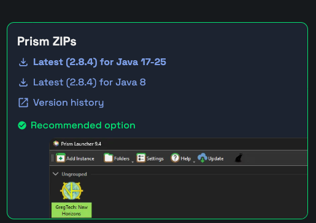

# GTNH Updater

A command-line tool for updating [GT New Horizons](https://www.gtnewhorizons.com/) Minecraft modpack installations between versions.

This tool automates the migration process described in the [GTNH Wiki](https://wiki.gtnewhorizons.com/wiki/Installing_and_Migrating), preserving your saves, configs, and other user data while properly merging configuration changes.

## Features

- **Automated instance creation**: Extracts the new version zip and creates a properly structured Prism/MultiMC instance
- **User data preservation**: Automatically copies saves, journeymap data, resource packs, and other user files
- **Smart config merging**: Uses git to perform 3-way merges of config files, preserving your customizations while incorporating new version changes
- **Conflict handling**: When config conflicts occur, clearly shows which files need attention and supports resuming after manual resolution
- **Update history**: Maintains config history across updates for proper incremental merging

## Installation

Requires Python 3.13+ and [uv](https://github.com/astral-sh/uv).

```bash
# Clone the repository
git clone https://github.com/yourusername/gtnh-updater.git
cd gtnh-updater

# Install dependencies
uv sync
```

## Downloading GTNH

This tool expects the **Prism/MultiMC zip files** from the official GTNH downloads page. Download the appropriate zip for your Java version:



Download page: [https://www.gtnewhorizons.com/downloads/](https://www.gtnewhorizons.com/downloads/)

## Usage

### Basic Update

```bash
uv run gtnh-updater update \
  --old "/path/to/instances/GTNH_2.8.0/.minecraft" \
  --new "/path/to/downloads/GT_New_Horizons_2.8.4_Java_17-25.zip" \
  --output "/path/to/instances/"
```

This will:
1. Extract the new version zip to create a fresh instance
2. Copy your saves, journeymap data, and other user files from the old instance
3. Merge your config customizations using git

### Options

```
--old, -o      Path to your current GTNH .minecraft folder (required)
--new, -n      Path to the new GTNH version zip file (required)
--output, -O   Directory where the new instance will be created (required)
--name         Custom name for the new instance folder (defaults to zip filename)
```

### Handling Config Conflicts

If config files have conflicting changes between your customizations and the new version, the tool will:

1. List all files with conflicts
2. Show you the path to the config repository where you can resolve them
3. Save state so you can resume after fixing

To resolve conflicts:

1. Open each conflicting file in the config repo
2. Look for merge conflict markers (`<<<<<<<`, `=======`, `>>>>>>>`) and resolve them
3. Stage resolved files: `git add <file>`
4. Complete the merge: `git commit`
5. Resume the update: `uv run gtnh-updater resume`

### Checking Status

```bash
uv run gtnh-updater status
```

Shows the status of any in-progress updates.

## What Gets Copied

The following user data is automatically copied from your old instance:

**Folders:**
- `saves/` - Your world saves (includes NEI data)
- `backups/` - World backups
- `journeymap/` - JourneyMap data
- `visualprospecting/` - Ore vein data for JourneyMap
- `TCNodeTracker/` - Thaumcraft node data for JourneyMap
- `schematics/` - Saved schematics
- `resourcepacks/` - Resource packs
- `shaderpacks/` - Shader packs
- `screenshots/` - Screenshots

**Files:**
- `localconfig.cfg` - Local config changes
- `BotaniaVars.dat` - Lexica Botania bookmarks
- `options.txt` - Minecraft options
- `optionsnf.txt` - NotEnoughItems options
- `servers.dat` - Server list
- `config/shaders.properties` - Shader settings

## How Config Merging Works

The tool uses git to intelligently merge configuration files:

1. On first update, it creates a git repository tracking both the old and new configs
2. It performs a 3-way merge to combine your customizations with the new version's changes
3. The repository is preserved in `.updater_config_repo/` for future updates
4. Subsequent updates use this history to properly merge incremental changes

This means your config customizations are preserved across multiple version updates (e.g., 2.8.0 → 2.8.4 → 2.8.5).

## Requirements

- Python 3.13+
- Git (for config merging - without it, configs are simply replaced)
- [uv](https://github.com/astral-sh/uv) package manager

## License

MIT License - see [LICENSE](LICENSE) for details.
